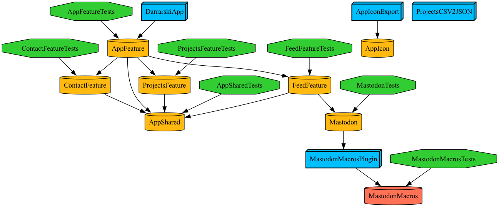
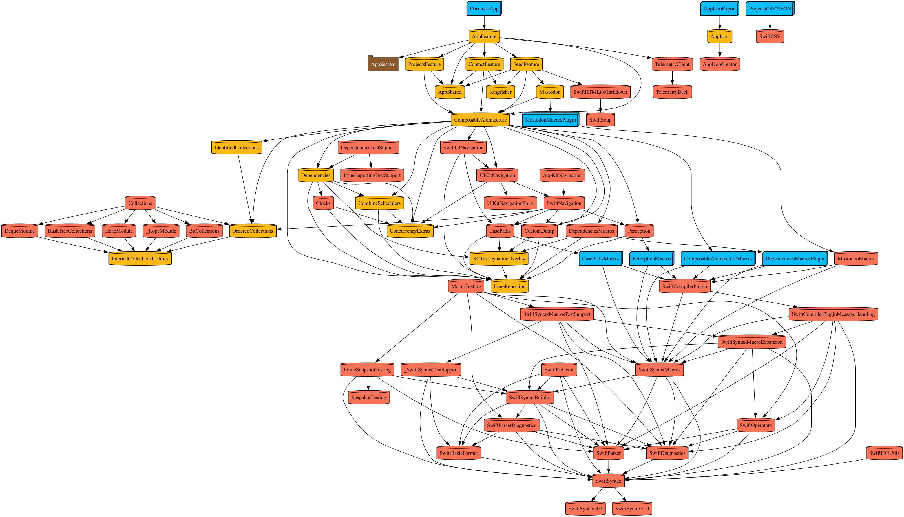

#  Darrarski.app


Hello, my name is Dariusz and this is the iOS & macOS SwiftUI application about my work and services.

<!-- [](https://apps.apple.com/app/darrarski/id6463758169) -->
[](https://testflight.apple.com/join/sGoIvYtI) 


## 📖 Documentation

Darrarski.app is as an example of a modular iOS & macOS application built with [Composable Architecture](https://github.com/pointfreeco/swift-composable-architecture) and [Tuist](https://tuist.io). 

### Workspace structure

<details open>
<summary>Dependency graph</summary>


</details>

<details>
<summary>Dependency graph with tests</summary>



</details>

<details>
<summary>Dependency graph with external dependencies</summary>



</details>

The Xcode workspace and projects are generated from manfest files (like `Workspace.swift` and `Projects.swift`).

### App modules

Individual features of the application are implemented as frameworks.

| Module | Description |
|:--|:--|
| [AppFeature](Projects/App/AppFeature) | Root feature of the application. Manages application state and presents split view or tabs navigation UI, depending on platform and device.
| [AppShared](Projects/App/AppShared) | Contains source code shared between other libraries.
| [ContactFeature](Projects/App/ContactFeature) | Contains contact screen UI, as well as the logic responsible for loading contact information from the backend.
| [FeedFeature](Projects/App/FeedFeature) | Implements social feed screen, based on posts fetched from Mastodon. Presents statuses and boosts with attachments.
| [Mastodon](Projects/App/Mastodon) | Provides models and API client for Mastodon network. Implements only a small subset of the API endpoints, that are needed by the app. Internally it uses swift macros for code generation (defined in [MastodonMacros](Projects/App/MastodonMacros) and [MastodonMacrosPlugin](Projects/App/MastodonMacrosPlugin)).
| [ProjectFeature](Projects/App/ProjectsFeature) | Implements screen with a list of projects. Each project, with some basic information about it, is presented on a grid. The list is fetched from the backend.

### Architecture

The application and its components are built using [Composable Architecture](https://github.com/pointfreeco/swift-composable-architecture). Each component of the application contains a state and action definition, as well as a reducer that mutates the state and handles side effects. The `State` clearly defines a data set the given component is operating on. The `Action` provides an interface for all events that the component is handling, like user interactions or receiving a response to a network request.


### Previews

Each view of the application is implemented in SwiftUI and comes with a preview. The preview is driven by a real `Store` and `Reducer`, but the application dependencies are mocked up for preview purposes. For example, an API client fetch-endpoint dependency immediately returns a JSON file loaded from disk, instead of performing an actual network request. This behavior allows for easier UI development in Xcode, in isolation from the outside world.


### App icon

The workspace contains a project named `AppIcon`. It provides `AppIcon` framework with SwiftUI implementation of the icon view. The included preview allows you to see how the icon will look on different platforms. The package also contains an executable target `AppIconExport`. It's used to render the icon and save it as assets for the app. This way of creating an app icon is possible thanks to [SwiftUI App Icon Creator](https://github.com/darrarski/swiftui-app-icon-creator).


### Tests

Every feature of the application is covered by unit tests. Each module can be tested in isolation, using the provided build scheme with the same name as the module, like `AppFeature`. All tests contained in the workspace can be run using `DarrarskiApp-Workspace` build scheme.


### Telemetry

The application uses [TelemetryDeck](https://telemetrydeck.com/) to collect anonymous information about how it's being used by the users.

> TelemetryDeck helps app and web developers improve their product by supplying immediate, accurate usage data while users use their app. And the best part: It's all anonymized so users' data stays private!

The fact that all events that can occur in the application are defined by the reducer's actions powers the logic responsible for producing telemetry signals. [`AppTelemetryReducer`](Projects/App/AppFeature/Sources/AppTelemetryReducer.swift) is responsible for describing each action in a privacy-aware way and then sending a telemetry signal.


> [!WARNING]  
> The AppID key required to communicate with TelemetryDeck is **NOT** included in the repository. If you want to use telemetry, you need to set your own key in `Projects/App/app-secrets/Sources/AppSecrets/Secrets/TelemetryDeckAppID`.

### CI/CD

The project is integrated with [Xcode Cloud](https://developer.apple.com/xcode-cloud/). There are two workflows defined: one that runs tests for each pull request, and one that archives the app and deploys it to TestFlight. For the deployment lane, the [ci_post_xcodebuild](ci_scripts/ci_post_xcodebuild.sh) script does some extra work. Version tag (e.g. `v1.0.0-123`) is added to the repository, and `WhatToTest` file is created with commit messages since the last tag. This file is automatically picked up by Xcode Cloud and used as release notes on App Store Connect.


## 🛠 Develop

- Use Xcode (version ≥ 16.0).
- Clone the repository or create a fork & clone it.
- Run `setup_for_development.sh` script to generate Xcode workspace and set everything up for development:
    ```sh
    $ scripts/setup_for_development.sh --open
    ```
- Use the `DarrarskiApp` scheme for building and running the app.
- Use other schemes to build or test individual libraries in isolation.
- If you want to contribute, create a pull request containing your changes or bug fixes. Make sure to include tests for new/updated code.

### Development scripts

The repository contains several scripts for ease of development. These are located inside [`scripts`](scripts) directory. You just need to run [`setup_for_development.sh`](scripts/setup_for_development.sh) once, and it should set everything up for development. Other scripts help to clean up the workspace, generate dependency graphs, etc. Each of the executable scripts accepts `--help` flag that prints info about the script and its usage.

```sh
$ scripts/setup_for_development.sh --help
OVERVIEW: Prepares everything needed for development.

USAGE: setup_for_development.sh [options]

OPTIONS:
  -o, --open      Open Xcode workspace.
  -h, --help      Show help information.
```

## ☕️ Do you like the project?

I would love to hear if you like my work. I can help you apply any of the solutions used in this repository in your app too! Feel free to reach out to me, or if you just want to say "thanks", you can buy me a coffee.

<a href="https://www.buymeacoffee.com/darrarski" target="_blank"></a>

## 📄 License

Copyright © 2023 Dariusz Rybicki Darrarski

License: [MIT](LICENSE)
